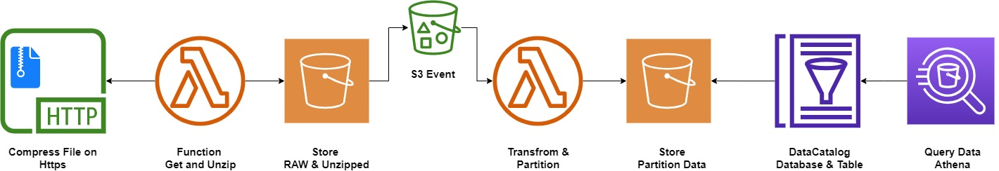

# Cloudformation Project to Read from HTTP and Store on S3



## Before you start
### Prerequisites

- AWS CLI V2 https://docs.aws.amazon.com/cli/latest/userguide/getting-started-install.html
- Setup the CLI and Credentials
- You need at Admin user to deploy the CFN Templates

## How to USE:

First you need to deploy the CFN

```bash
aws cloudformation deploy --template-file dataprocessproject.yaml --stack-name data-proccesing --region us-east-1 --capabilities CAPABILITY_NAMED_IAM
```

In order to run the cralwer that will create the table to be query with Athena you need to run

```bash
aws glue start-crawler --name sales-crawler --region us-east-1
```

When you enter the Athena Service, you need to pick up sales-workgroup, this workgroup is setup with the CFN Templates.

Then you just need to select:

- Data source : AwsDataCatalog
- Database : salesdatabase
- Table : salessales


## How would I do it

### IAC 

I would rather used CDK with Python for more funcional CFN development

### Data Papiline 

Using AWS Step Functions to Trigger frist the Lambda to Extract the file into S3

Then use AWS Glue (Spark) to read the CSV and then do the tranform into the Analytics Bucket

### Development

I would have use Glue Interactive Sessions Notebooks, to Develop the core transformation.

